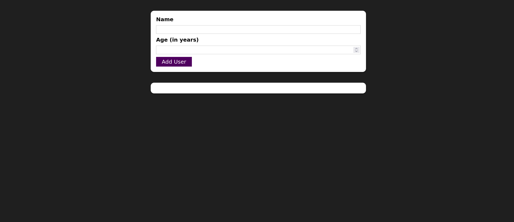

#  React simple application

This simple application is made in ReactJs in which we can create a user using form and add validation for incorrect inputs.

In this application, the following concepts are reflected.

- react portals
- react fragments (created my own for learning, but in most cases used react in build portal)
- react in build "Css modules"
- Events Listening & Working with Event Handlers
- Working with "State"
- Form Inputs
- Multiple States
- Updating State That Depends On The Previous State
- Two-Way Binding
- Child-to-Parent Component Communication (Bottom-up)

### Screen shots

default UI

UI after adding some data.

UI with empty inputs

UI with negative age value

